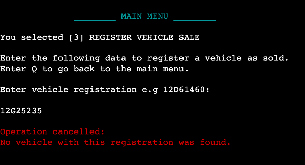

# Automated Auto Dealer

## Data-Centric Frontend Development Milestone Project.

Welcome to Automated Auto Dealer! An inventory management tool for car dealerships to manage incoming inventory and
and outgoing sales.

The command-line application is built to provide ease in data management and editing for any caliber of auto trading
business. With a concise layout with extensive input validation, it provides the user with the means of manipulating 
and changing current stock, analysing recent sales and keeping key information within an easily accessible platform.

My goal is to achieve an industry-standard application with true purpose and efficient functionality for the user
and or business owner.

The application utilises two Google sheets to manipulate and store data. 
[View a published representation of the spreadsheets](https://docs.google.com/spreadsheets/d/e/2PACX-1vQXu3XEV_6LwiIKBBGe7yLibX8Np6Uud8U3TJmXO-_bpWvDfx8slS3pM8W0kmvMhrkH5313yMxmiKO5/pubhtml#)

The application is currently deployed as a mock terminal through heroku and feel free to check it out for yourself :)

## [View the deployed website here!](https://automated-autos.herokuapp.com/)
---

# Table of contents

- [UX](#ux)
    - [Website Owner Business Goals](#website-owner-business-goals)
    - [User Goals](#user-goals)
        - [New User Goals](#new-user-goals)
        - [Returning User Goals](#returning-user-goals)
    - [User Story](#user-story)
    - [Flowchart](#flowchart)
- [Features](#features)
- [Technologies Used](#technologies-used)
- [Testing](#testing)
    - [Functionality Testing](#functionality-testing)
    - [Bugs Encountered During Development](#bugs-encountered-during-development)
    - [Code Validation](#code-validation)
- [Deployment](#deployment)
- [Credits](#credits)

# UX

## Website owner business goals

The motive for making this application was to create an application for auto trader/ auto dealership data management.
The application displays all relevant and recent inventory.
The application records newly registered sales, which can be listed in their entirety.
The application allows for data editing and manipulation when needed by the business owner, inventory manager or
sales leader.

## User goals

### New user goals:
- New user is able to navigate through the application menus with ease.
- New user can navigate the menu by arrow keys or by keyboard shortcut.
- New user can understand simply and effectively displayed data when that's what is desired.
- New user can confidently add inventory because of thorough input validation.
- New user can register recent sales/ edit inventory as a result of explicit validation to check for inventory and
confirm changes.

### Returning user goals:
- Returning User can easily navigate the well-defined navigation menus.
- Returning User can view up-to-date data at the end of each day without fault.
- Returning User can monitor business performance by comparing outgoing/ incoming inventory.
- Returning User can edit the current inventory if needed e.g. if a vehicle price needs to be reduced.
- Returning User can register a deposit being taken for a vehicle as well as remove a deposit if required.

## User story

### As a business owner:
* I would like to manage my auto trader business through a single application.
* I want to mitigate strenuous tasks such as accessing, editing and updating multiple spreadsheets.
* I need to remove the need for paper stock management as it leads to error and mishandling of information.
* I want to view current inventory/ past sales when requested.
* I would like to add/ remove deposits taken for vehicle sales, as well as know if there is already an existing
deposit outstanding on the vehicle.

# Flowchart

To aid the development process of building the application, I used [Lucid Chart](https://www.lucidchart.com/) to 
visualise the organisational flow. This also helped me organise and demonstrate extensive input validation to 
ensure that key data being sent to both the inventory spreadsheet and sales spreadsheet is completely valid.

# Features

## Homepage

The homepage is displayed when the application is initially ran and again when the terminal is cleared if 
the user wishes to exit the program. 
It uses ASCII font to display an application title. As well as this, it is accompanied by a subheading that
describes the purpose of the application as well as a cheeky accreditation for the creator ;)

## Main menu

The main menu is displayed when the application is initally ran, as well as when the user has completed
any of the applications processes.

It gives the user five options, including four application processes and one exit function.

I used the simple_term_menu python library to display the menu as one in which can be used using arrow keys
as well as the keyboard shortcut number for each option.

## [1] View inventory

The edit inventory function gives the user three options: view current inventory, view recent sales or back
to the menu.

When either of the two first options are chosen, the application fetches the data from the Google Sheets and
displays the data in an easily understandable manner.

If the back to menu option is chosen, the menu is then displayed again, the same occurs after the processes
of the first two options is complete.

## [2] Add inventory

The add inventory option presents the user with a series of user inputs to complete, which account for the
necessary car details for recording inventory data which are: registration, make, model and price.

The inputs are passed through extensive input validation to ensure the data is valid e.g. the price has to be 
numeric and the registration must be alphanumeric.

The application also checks whether a vehicle with that registration aready exists in the inventory, hence,
preventing unwanted duplication of data.

If user input is deemed invalid the application will display "Operation Cancelled:" and the reason for such.

On the other hand, if the user input is valid, the user will be shown a summary of the information they
provided and the vehicle will be added to the inventory Google sheet if the user selects "Yes".

If the user selects no as a result of an error in their inputting of the data, the menu will be displayed 
again.

## [3] Register vehicle sale

The register vehicle option requests a user input of a vehicle registration and with this, checks if a 
vehicle with this registration is found in the inventory worksheet.

If no vehicle is found, the user is notified and the menu is displayed again.

If a vehicle with that registration is found, it is displayed and the user can select to register that
vehicle as sold. Doing so will remove said vehicle from the inventory worksheet and subsequently add it to
the corresponding sales worksheet.

## [4] Edit inventory

The edit inventory, like the "Register vehicle sale", also checks for an existing vehicle of the inputted 
registration in order for the process to run successfully.

Upon finding a vehicle in the inventory with the inputted registration, the user can choose to edit the price
of the vehicle, register that a deposit has been paid for the vehicle or to remove an existing deposit.

Before choosing which operation they want to carry out, the application displays the details of the vehicle found 
so the user can ensure they selected the correct vehicle.

[1] Edit price:
* The new price for the vehicle will be verified by various input validation measures.
* If new price is a valid value the price of the vehicle will be changed.
* The application will display the new vehicle data for the edited vehicle

[2] Add deposit:
* The vehicle selected will be checked for if there is an existing deposit being held by it.
* If a deposit is already held on the vehicle, the user will be notified, the operation will be cancelled and
the menu will be displayed again.
* If no deposit is held on the vehicle, the user is prompted to enter the amount of a deposit taken.
* If deposit value passes input validation e.g. must be at least 500, the deposit will be added and the 
updated vehicle data will be displayed to the user.

[3] Add deposit:
* The vehicle selected will be checked for if there is an existing deposit being held by it.
* If there is no existing deposit for the vehicle, the user will be notified, the operation will be cancelled and
the menu will be displayed again.
* If there is an existing deposit that needs to be removed, the user will be prompted to answer are they sure that
they wish to remove it.
* The deposit is then removed and the updated car details are displayed to the user.

[4] Back to menu:
* If this option is selected, the user is brought back to the main menu where they can choose to utilise another 
operation or to quit the application.

## [5] Quit

The quit option simply closes the application for the user and displays both the homepage and the exit page.

It notifies the user that the application has been closed succesfully and thanks them for using 'Automated Auto Dealer'.

